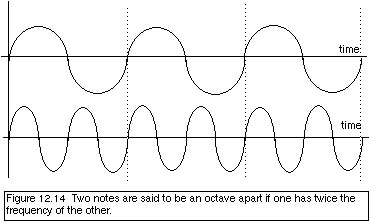
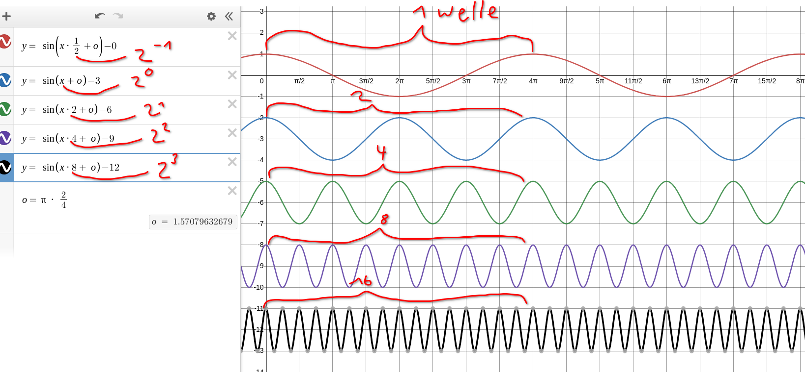

Harmonie-lehre 
--- 
# was ist ein ton ?

## praxis 
nimm ein gummeli, schneide es durch und spann es zwischen deine zähne und deine finger. nun kannst du diese gerade künstlich erstellte saite anzupfen. es ertönt ein ton. 
wenn du die saite locker gespannt hast ertönt ein tiefer ton. Spanne die saite nun an der ton wird höher! wenn du die saite genug spannst kann es sein das der [selbe tiefe ton nun höher ertönt](###oktave)(oktave). sei aber vorsichtig beim anspannen des gummelis, sonst reisst es noch xD. 

## theorie 

### oktave
unsere töne wiederholen sich also , es gibt zwar hohe und tiefe töne , aber nicht unendlich viele , irgendeinisch wiederholen sie sich! diese wiederholung nennt man <b>oktave</b>.

### frequenzen 
eine frequenz ist eine welle die immer hin und her schwingt. wenn nun zwei wellen schwingen und die <b>eine ist doppelt so schnell wie die andere</b> dann ist dies eine oktave! die töne sind dann zwar nicht der gleiche ton, jedoch ist der ton ähnlich da er die selbe grundfrequenz, einfach ein bestimmtes mehrfaches davon hat. der ton mit der langsameren(längeren) welle ist der tiefere/bass ton. die frequenz ist das gleiche wie die anzahl bögen, viele bögen pro sekunde heisst eine hohe frequenz, wenige bögen eine tiefe. der kammerton A4 ist bei stimmgeräten oft auf 440hz also 440 bögen pro sekunde ausgelegt. 

 
eine oktave ensteht nur wenn die frequenz doppelt so schnell ist oder das doppelte vom doppelten ist, mathematisch ausgedrückt: oktave = grundfrequenz * (2n) 

https://www.desmos.com/calculator/6tw7ewgon8

### keine oktave
wenn die frequenz der zweiten welle 3-,5-,6-,7-,9-,10-,11-,12-,13-,14-,15-,17-,18-...usw mal so schnell ist entsteht keine oktave.

### wir hören es
ich höre es einfach irgendwie aber versuche hier mal zu erklären wie man eine oktave erkennen kann. 
1. wenn die zwei töne nicht harmonieren und eine gewisse spannung erzeugen ist es sehr wahrscheinlich mit sicherheit keine oktave
2. wenn die zwei töne harmonieren muss dies nicht heissen dasses eine oktave ist , wenn sie eine bestimmte stimmung hervorrufen ist es wahrscheinlich keine oktave 
3.  wenn die zwei töne fast zu einem ton zusammenschmelzen ist es sehr wahrscheinlich eine oktave. 

## übung 
hör dir dieses audio an. Es werden immer 2 töne nacheinander abgespielt danach folgt eine pause und nun wieder 2 töne. versuch zu erkennen onb die 2 aufeinanderfolgenden töne eine gleich, also eine oktave sind oder nicht. es kann auch sein dass der erste ton höher ist als der zweite. es kann auch sein dass der abstand zwischen zwei tönen 2 oktaven beträgt. 

<audio controls>
  <source src="./octave_lesson.mp3" type="audio/mpeg">
Your browser does not support the audio element.
</audio>

<input type="radio">

<button onclick="document.querySelector('#asdf').style.display = 'block'">lösung anzeigen</button>

<h2>lösung</h2>

1 nein  
2 nein  
3 nein  
4 oktave  
5 nein  
6 oktave  
7 nein  
8 komische audio fehler 
9 komische audio fehler 
usw komische audio fehler 

