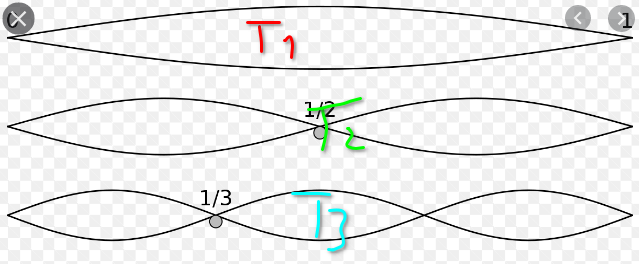

# Probe 1 - 20.05.2021

## Vorname: 
## Name:    
## Punkte:&nbsp;&nbsp;&nbsp;/ 12
## Note: 

---
## Was ist ein ton ? (erkläre in deinen worten) (2p)

 
 
 

## nehmen wir an... (2p)
du spannst ein gummeli und zupft es als wäre es eine saite, es ertönt ein ton. nun ziehst du das gummeli an und es ertönt wieder ein ton. welcher ton ist höher ? wenn du das gummeli immer stärker spannst und immer wieder anzupfst , was passiert mit den tönen , was fällt auf ?
 
 
 
 
 
 
 
 

## sind diese töne gleich ? (3p)
wir sehen hier 3 töne, ton 1 T1, ton 2 T2 und ton 3 T3... 

 
 

### sind T1 und T3 'gleich' ? 
 
 

### sind T1 und T2 'gleich' ? 
 
 

### ordne die töne nach der reihenfolge: der akkustisch höchste ton zuerst , zuletzt der tiefste
 
 

## Zusatzfrage: was ist "microtonal" (1p)
 
 
 

## hörverstehen (4p)
ich spiele dir immer zwei töne vor, schreib auf 'oktave' oder 'keine oktave' 

### 1) 
### 2) 
### 3) 
### 4) 
### 5) 
### 6) 
### 7) 
### 8) 